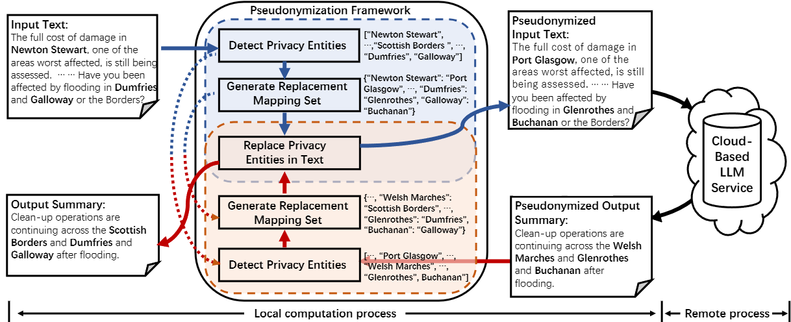

# A General Pseudonymization Framework for Cloud-Based LLMs: Replacing Privacy Information in Controlled Text Generation

[](https://arxiv.org/abs/2502.15233)
[](https://github.com/Mebymeby/Pseudonymization-Framework)

[](https://opensource.org/licenses/MIT)

## 概述  

本代码仓库包含以下论文的实现代码：  
**A General Pseudonymization Framework for Cloud-Based LLMs: Replacing Privacy Information in Controlled Text Generation**

框架示意图：  
  

## 快速开始  

1. 下载所需的模型文件到 `<project_path>/Model/` 目录。模型的具体要求请参考 `<project_path>/Config/model_config`。  
2. 下载所需的数据集到 `<project_path>/Dataset/` 目录。数据集的详细信息可在 `<project_path>/Config/dataset_config` 中查看。  
3. 选择以下两种方式之一配置评估指标：
   - 下载评估指标代码到 `<project_path>/Metrics/`，或  
   - 直接在代码中导入 `evaluate` 库  
4. 安装所需依赖。  
5. 进入 `<project_path>` 目录，并运行推理脚本：  
    ```python
    # 示例命令（使用 squad 数据集，方案为 ner_rand_direct）：
    python main.py --dataset squad \
                   --data_split validation \
                   --data_size 1000 \
                   --eval_model Qwen2.5-14B-Instruct \
                   --eval_model_gpu 0 \
                   --comment ner_rand_direct \
                   --embedding_model all-mpnet-base-v2 \
                   --ner_model ner_pipe \
                   --ner_keys entity \
                   --entity_score_threshold 0.8 \
                   --entity_map_method ner_dict_select \
                   --rep_gen_method str_replace \
                   --recover_method str_replace
    ```
   查看所有可用参数，请参考 `<project_path>/Utils/argparse_util.py`。  

## 主要特性  

- **隐私保护**：提供基于大模型的去标识化框架，用于在云端 LLM 交互中保护隐私信息  
- **多种策略**：支持多种实体检测、生成和替换方法  
- **自定义阈值**：可调整隐私检测的阈值，以适应不同应用场景  
- **组合灵活**：支持不同方法的自由组合，以满足多种需求  
- **全面评估**：集成多种评估指标，确保方案的有效性  

## 项目结构  

```
.
├── Config/               # 配置文件
│   ├── model_config      # 模型配置信息
│   └── dataset_config    # 数据集要求
├── Dataset/              # 数据集存储（需手动创建空目录）
├── Model/                # 预训练模型存储目录
├── Output/               # 存储结果、日志和中间结果
├── Metrics/              # 评估指标（可使用 evaluate 库）
├── Utils/                # 实用工具函数
│   └── argparse_util.py  # 参数解析配置
└── main.py               # 主运行脚本
```  

## 引用  

如果本项目对您的研究有帮助，请引用我们的论文：  
```bibtex
@misc{anonymous2024pseudonymization,
  title         = {A General Pseudonymization Framework for Cloud-Based LLMs: Replacing Privacy Information in Controlled Text Generation},
  author        = {Anonymous},
  year          = {2025},
  archivePrefix = {arXiv},
  eprint        = {2502.15233},
  primaryClass  = {cs.CL}
}
```  

## 许可证  

本项目基于 [MIT 许可证](LICENSE) 开源。  

## 联系方式  

如有任何问题，请通过以下方式联系我们：  
- 在 GitHub 提交 issue  
- 发送邮件至：hou_work@yeah.net 或 longzi@sztu.edu.cn